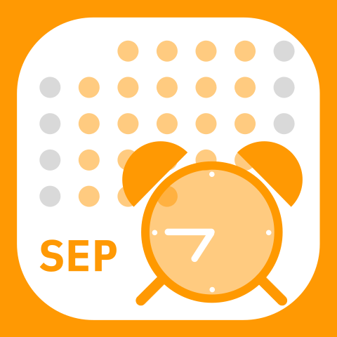
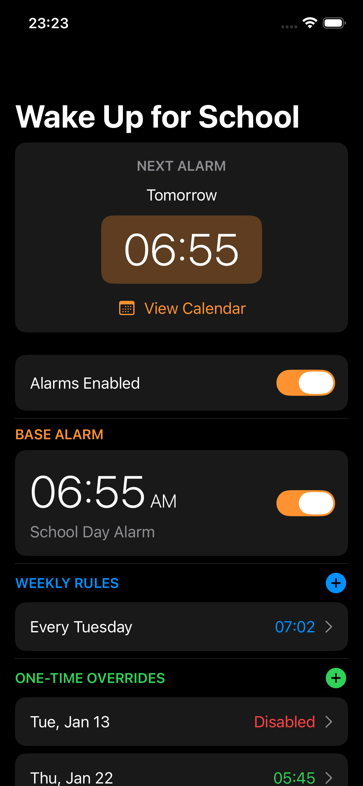
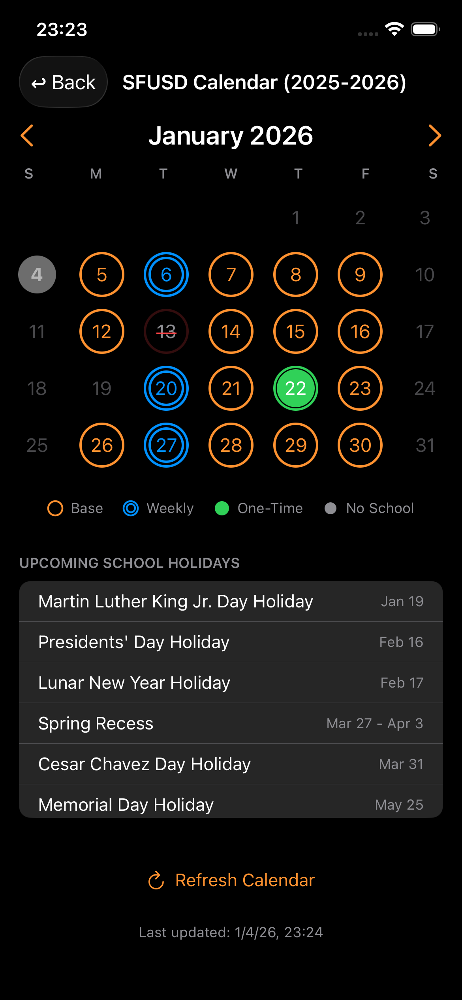

# SchoolAlarm

A smart alarm clock app for Bay Area school families. The app automatically schedules alarms only on school days by syncing with official school district calendars.

## Supported Districts

- **SFUSD** - San Francisco Unified School District
- **BUSD** - Berkeley Unified School District

_Fremont USD is supported by the codebase but held from release until FUSD publishes its 2026-27 instructional calendar to a machine-readable feed._

<p align="center">
  
  
</p>

## Features

- **Multi-District Support**: Select your school district on first launch, change anytime from settings
- **Smart School Day Detection**: Automatically fetches and parses district calendars to determine school days
- **Layered Override System**:
  - Base alarm time (applies to all school days)
  - Weekly rules (e.g., "7:30 AM every Wednesday")
  - One-time date overrides (e.g., "skip alarm on Dec 20")
- **True System Alarms**: Uses iOS 26 AlarmKit for alarms that break through DND and silent mode
- **Snooze Support**: 5-minute snooze for normal alarms (15 seconds in debug builds for testing)
- **Custom Alarm Sounds**: Bundled sounds including kid-friendly options
- **Background Refresh**: Automatically reschedules alarms when needed

## Requirements

- iOS 26.0+
- iPhone or iPad

## Configuration

### District Selection

On first launch, select your school district. The app will download that district's calendar and use it for school day detection. To change districts later, tap the district name in the top-right corner of the main screen.

### Alarm Settings

1. **Create a base alarm**: Set your default wake-up time that applies to all school days
2. **Add weekly rules** (optional): Create or Override the base time for specific days of the week
3. **Add one-time overrides** (optional): Create or Override alarm time for specific dates

The priority of these settings goes 3>2>1, so the highest applicable setting wins. It's also OK to not have a base alarm if you only need it for specific weekday(s) or dates.

## Calendar Sources

Each district's calendar is fetched from official ICS feeds:

| District | Calendar Source |
|----------|-----------------|
| SFUSD | Google Calendar (sfusd.edu) |
| BUSD | Google Calendar (berkeley.net) |

The app caches each district's calendar locally with per-district storage. Calendars refresh automatically when the app is opened.

## Project Structure

```
SchoolAlarm/
├── App/
│   ├── SchoolAlarmApp.swift    # App entry point, district flow
│   └── ContentView.swift       # Main UI with alarm list
├── Models/
│   ├── Alarm.swift             # Alarm model and AlarmStore
│   ├── District.swift          # District model (id, name, calendar URL, school year dates)
│   ├── OverrideModels.swift    # Weekly rules and date overrides
│   ├── OverrideStore.swift     # Override management
│   └── SchoolCalendar.swift    # Calendar data model
├── Views/
│   ├── AlarmEditView.swift     # Edit alarm time/sound/label
│   ├── CalendarView.swift      # Monthly calendar with override indicators
│   ├── DistrictSelectionView.swift # District picker with search
│   ├── OnboardingView.swift    # First-launch district selection
│   ├── WeeklyRuleEditView.swift    # Edit weekly override rules
│   └── DateOverrideEditView.swift  # Edit one-time date overrides
├── Services/
│   ├── CalendarService.swift   # Fetches and parses district calendars
│   ├── DistrictStore.swift     # Loads districts, persists selection
│   └── AlarmKitManager.swift   # Schedules alarms using AlarmKit
├── Utilities/
│   └── ICSParser.swift         # Parses ICS calendar format
└── Resources/
    ├── Assets.xcassets         # App icons and colors
    ├── districts.json          # Bundled district configurations
    ├── funny_ring.caf          # Alarm sounds
    ├── click_ring.caf
    ├── kid_shouting_1.caf
    └── kid_shouting_2.caf
```

## Building

1. Open `SchoolAlarm.xcodeproj` in Xcode
2. Select your development team in Signing & Capabilities
3. Build and run on your device (AlarmKit requires a physical device)

## Debug Features

Debug builds include a test section at the bottom of the main screen:
- Schedule test alarms at various delays
- View pending alarm counts
- Check alarm authorization status
- Cancel test alarms

These features are compiled out in Release builds.

## License

MIT License. See [LICENSE](LICENSE) for details.
